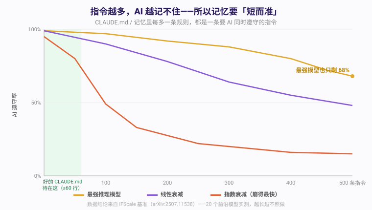
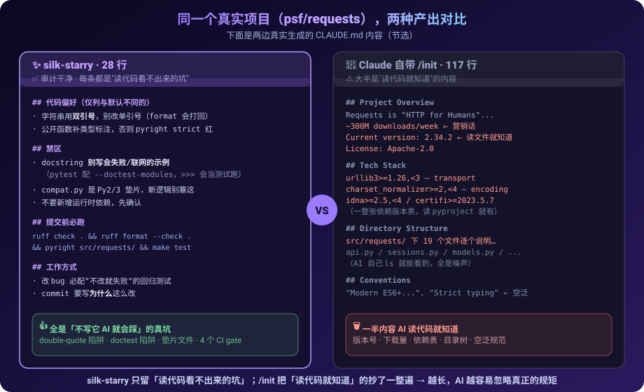
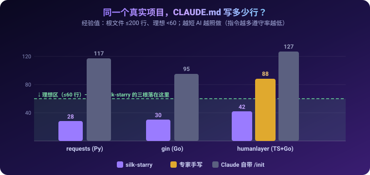
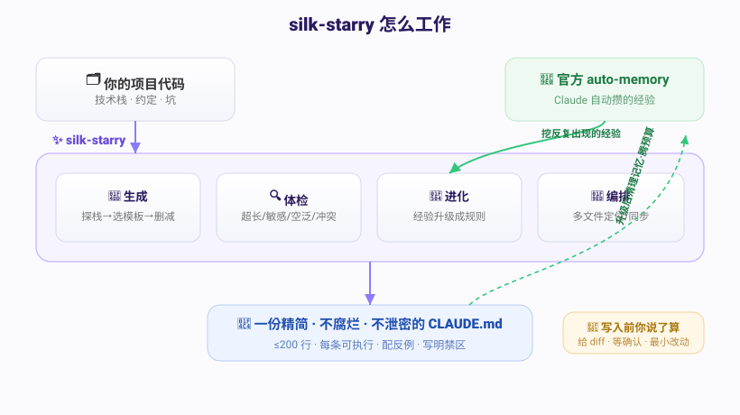
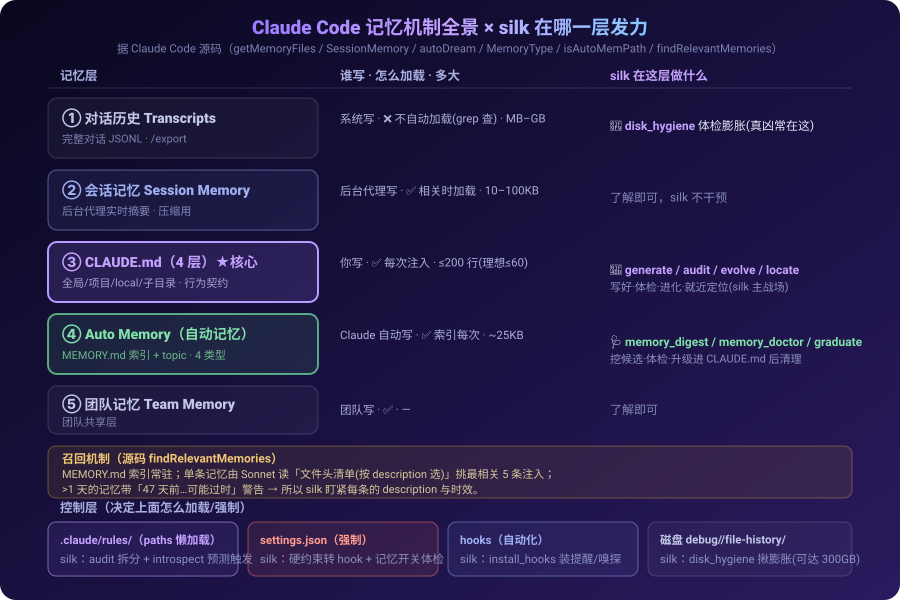

<div align="right"><b>简体中文</b> | <a href="README_EN.md">English</a></div>

<div align="center">

# ✨ silk-starry

**帮你管好 Claude Code 的一整套记忆机制 —— `CLAUDE.md`、auto-memory、`.claude/rules`、磁盘，自动生成 · 体检 · 进化，无需手写、无需惦记维护。**

[](https://code.claude.com/docs/en/skills)
[](https://github.com/hjxccc/silk-starry/actions/workflows/ci.yml)
[](https://github.com/hjxccc/silk-starry/actions/workflows/ci.yml)
[](#)
[](CHANGELOG.md)
[](LICENSE)


</div>

---

## 它解决什么

用 Claude Code 久了你会发现：它其实有**一整套「记忆机制」**——`CLAUDE.md`（你写给 AI 的项目规矩）、auto-memory（Claude 自动记的笔记）、`.claude/rules/`、以及会悄悄堆大的历史记录。**用好它，AI 越用越懂你的项目；用不好，AI 越用越笨。**

可这套机制对大多数人还是个黑盒，常见的困惑有：
- 这条经验，该记进**哪一层**？（写进 CLAUDE.md？留给 auto-memory？还是该转成 hook？）
- 我的 `CLAUDE.md` 多长算**太长**？哪些内容根本是废话？
- 哪一层在**悄悄过期、误导 AI**？
- `~/.claude` 怎么就占了**好几个 G**？是被记忆撑爆的吗？

其中最关键、也最容易写坏的就是 **`CLAUDE.md`**——它每次会话注入上下文，直接决定 AI 写代码靠不靠谱，可偏偏**难写好、更难维护**：

- **写长了 AI 记不住**——Anthropic 官方明说「CLAUDE.md 太长会被忽略一半」；独立研究 [IFScale](https://arxiv.org/abs/2507.11538) 也实测「指令越多遵守率越低，500 条下最强模型只剩 68%」（社区常用经验值 ≤200 行）；
- **写成目录树、技术栈清单**——全是读代码即知的废话，白占上下文；
- **放着不管会随代码腐烂**，半年后还在误导 AI；
- 一不留神，把**口令、内网地址**写进去还提交进了 git。

**silk-starry 把这套记忆机制整个替你管起来**：帮你**写**一份精准的 CLAUDE.md、定期**体检**、项目变了帮你**更新**；反复出现的经验帮你**升级**成规则；auto-memory 和磁盘膨胀帮你**体检**；多模块仓库里还告诉你**这条经验该放哪一层、改这块代码该看哪一份**。

> **核心目标：让不懂这套记忆机制的人，也能把它用好。** 你不需要懂五层记忆、Auto Dream、各种开关——只管用大白话说，silk 替你**放对层、写得准、各层保持干净**。理念上：把 `CLAUDE.md` 当「给 AI 的行为契约」经营，把整套记忆当一个**能托管、不腐烂的系统**。

**为什么"短而准"是硬道理**——记忆里每多一条规则，都是一条要 AI 同时遵守的指令；指令越多，遵守率越低：

<div align="center"></div>

---

## 安装

**一行命令**（推荐）：
```bash
npx skills add hjxccc/silk-starry
```

**手动**：克隆到 `~/.claude/skills/silk-starry/` 即可：
```bash
git clone https://github.com/hjxccc/silk-starry.git ~/.claude/skills/silk-starry
```
装毕，全项目自动可用，无需任何额外配置。

---

## 使用方法

**三步上手：**

1. **装好**（见上一节，一行命令）。
2. 在你的项目目录里，对 Claude 说一句大白话——**「帮我给这个项目生成一份 CLAUDE.md」**。
3. silk-starry 自动接手：探技术栈 → 套模板 → 做减法、只留「读代码看不出来」的关键规矩 → 自检，把结果摆到你面前。**你点头，它才落地；绝不偷偷写文件。**

就这么简单——你不必记任何命令，silk-starry 听得懂大白话。

> 💡 万一没自动触发，点名一句「**用 silk-starry 帮我……**」即可（100% 调用）。

### 想做什么，直接说

下面每组都是 silk-starry 能接住的说法，挑顺口的说就行：

**生成一份新的**
```
帮我给 frontend 模块写个 CLAUDE.md
这个项目还没有 CLAUDE.md，帮我建一份
```
**体检 / 精简**
```
审查一下我的 CLAUDE.md
我的 CLAUDE.md 太长了，帮我精简
看看里面有没有写得太空、或藏了密码的地方
```
**记规则 / 收尾沉淀**
```
把「提交前必跑 pnpm lint」记进项目规则
这轮聊下来，有啥值得记进 CLAUDE.md 的？
```
**多份理顺 / 定位**
```
帮我把这堆 CLAUDE.md 理顺
我要改 api 这块，该看哪一份 CLAUDE.md？
```

> **什么时候*别*用它**：写 README、补代码注释、写 API 文档——这些不是「项目记忆」，普通对话就够了，silk-starry 也不会乱触发。

<details>
<summary><b>🔹 偏好斜杠命令？（可选）</b>　只有一个命令要记：<code>/silk</code></summary>

<br>

不用记一堆命令——**就一个 `/silk`**，后面用大白话说你想干啥，silk 自己判断该生成 / 体检 / 进化 / 盘点：

```
/silk 给这个项目生成一份 CLAUDE.md
/silk 我的 CLAUDE.md 太长了，精简一下
/silk 把"提交前必跑 lint"记成规则
/silk 体检一下 auto memory
/silk            ← 留空：它先盘点现状再问你想做什么
```

安装（把命令文件拷进 Claude 的命令目录）：
```bash
mkdir -p ~/.claude/commands && cp ~/.claude/skills/silk-starry/commands/silk.md ~/.claude/commands/
```
装完输入 `/silk` 就能用。

</details>

<details>
<summary><b>🔹 开启「自动提醒」？（可选）</b>　开会话提醒你体检、收尾把你的纠正记成待办</summary>

<br>

```bash
python ~/.claude/skills/silk-starry/scripts/install_hooks.py <项目根目录>
```
这会修改该项目的 `.claude/settings.json`（与你已有配置合并，不覆盖）；运行前它会先把改动告诉你。

</details>

<details>
<summary><b>🔹 它背后用了哪些工具？</b>　你不用记，silk-starry 自己会跑——列出来只为让你心里有数</summary>

<br>

| 工具 | silk-starry 用它来…… |
|---|---|
| `scan` | 盘点全仓 CLAUDE.md、找出缺文档的模块、查 `.env`/密钥有没有被 git 跟踪 |
| `audit` | 体检一份 CLAUDE.md：超长 / 藏密 / 空泛 / 失效链接 / 该下沉哪几段 |
| `locate` | 算出「改某文件该看哪份 CLAUDE.md」 |
| `conflicts` | 检测多份 CLAUDE.md 之间有没有自相矛盾 |
| `introspect` | 预测「编辑某文件会加载哪些 CLAUDE.md/规则、合计多大」 |
| `memory_digest` | 从 Claude 的 auto-memory 里挖「值得升级成规则」的候选 |
| `graduate` | 升级后把对应记忆清理掉、腾出空间 |
| `sync_targets` | 把 AGENTS.md 和 CLAUDE.md 打通（一份内容多工具通用） |
| `install_hooks` | 给项目装「自动提醒」钩子 |

> 都是 Python 标准库写的、默认只读，会写文件的那几个都先给你看 diff。手动跑：
> `python ~/.claude/skills/silk-starry/scripts/<工具名>.py <参数>`

</details>

---

## 四种能力（详解）

| 能力 | 它具体做什么 |
|---|---|
| 📝 **生成** | 识别技术栈，产出一份简短、可执行、配反例的契约，自动剔除「读代码即知」的冗余。 |
| 🔍 **体检** | 揪出超长、空泛、藏密、失效链接，并指出哪几段该下沉到 `.claude/rules/`。 |
| 🔄 **进化** | 把你反复叮嘱 AI 的事沉淀为正式规则，无需每次重复提醒。 |
| 🧭 **编排** | 大项目常把好几个模块放进同一个仓库；silk-starry 帮你把这一整套 CLAUDE.md 分门别类管起来：哪个模块缺、根/子各写什么、有没有自相矛盾、改某块该看哪一份。 |

> 附带能力：**主动拦截密钥泄露**——读到的明文口令会被改写成「禁止硬编码凭证」的禁区规则，而不是照抄进文件。

---

## 实测，用数据说话

口说无凭。我们在**真实开源项目**上做了完整对照。

> 说明：**Claude Code 本身自带一个 `/init` 命令**，敲它就能自动生成一份 CLAUDE.md——这是目前大多数人用的方式。所以我们主要拿 silk-starry 跟它比。

**先看真实产出**——同一个项目（`psf/requests`），silk-starry 写的 vs Claude Code 自带的 `/init` 写的：

<div align="center"></div>

**再看行数**（越短，AI 越照做）：

<div align="center"></div>

| 维度 | 结论 |
|---|---|
| **判断准** | 我们准备了 20 句真实提问——10 句该用 silk-starry 的、10 句故意相似却不该用的（比如「帮我写个 README」「给函数补注释」）。silk-starry **20 句全判断对**：该出手时出手，不沾边时绝不乱触发。 |
| **更精炼** | 同一项目 **28 行 vs 117 行**；且 **0 泄密**——Claude Code 自带的 `/init` 默认会把读到的明文口令照抄进文件。 |
| **胜过专家** | 对标写过《Writing a good CLAUDE.md》的 HumanLayer：silk-starry 写得更短，且**当场发现他们手写那份已经过时**（里面写的内容跟现在的代码对不上了），还补上了他们漏写的坑。 |
| **够稳** | 故意喂 24 种「坏数据」（空文件、乱码、超大文件、想越权删文件的恶意路径……）**没有一种把它搞崩**。 |
| **够快** | 7000+ 文件的仓库，**1.1 秒**扫完。 |
| **多语言** | Python / Go / Rust / TypeScript / Ruby 均已验证。 |

### 关于效果，需要客观说明
我们不声称「装上就不会犯错」。一组对照实验（唯一差别是有没有 CLAUDE.md）显示：**当 AI 愿意把代码读透时，有没有 CLAUDE.md 都能避开坑**。CLAUDE.md 真正的价值在于——**省去每次的逐行通读、兜住 AI「没读全就动手」的情况、保证每次表现稳定**；项目越大、越赶时间，它越关键。silk-starry 的职责，是让这份契约**写得准、保持精简、不过期**。我们连可能削弱结论的角度都一并测了——这恰恰是它可信的地方。

---

## 架构 & 设计亮点

<div align="center"></div>

silk 不止管 CLAUDE.md，而是站在 Claude Code **整套记忆机制**之上——下面这张图（据 Claude Code 源码梳理）说明每一层是什么、怎么加载，以及 **silk 在哪一层发力**：

<div align="center"></div>

**一句话架构**：silk-starry 是**官方 auto-memory 之上的「策展层」**——官方负责自动「捕获」经验，silk-starry 负责把它「写好、体检、升级进 CLAUDE.md」，**不重造轮子**。

借鉴与依据：
- **Anthropic 官方机制**（取自 Claude Code 的 `init` / `memdir` / `sessionMemory` 实现）：记忆召回沿用「读文件头 manifest，让模型按描述挑选」而非词频（参考 `findRelevantMemories`）；时效用「47 天前」这类人类可读串（模型对日期算术不敏感，参考 `memoryAge`）；长度/字节阈值对齐官方常量，但作软告警而非硬截断。
- **[Karpathy 编码准则](https://github.com/multica-ai/andrej-karpathy-skills)** → 内置可选的「12 条行为契约」，并把 **Surgical Changes（最小 diff）** 用于 silk-starry 自身的改写逻辑。
- **微软 SkillLens / SkillOpt 的 9 维评分**（经 darwin-skill）→ 用于打磨 silk-starry 自己的 `SKILL.md`：显式失败分支、🔴 检查点、禁软化措辞、反例黑名单。
- **AGENTS.md 跨工具标准** + Cursor/Copilot 的 **glob 路径规则** → silk-starry 的跨工具同步与 `paths:` 规则拆分由此而来。

关键机制：
| 机制 | 说明 |
|---|---|
| **准入门槛** | 每条规则须能回答「不写它，AI 会做错哪件*具体*的事」——答不上即删（与官方新版 `/init` 同源）。 |
| **升级闭环** | 反复出现的记忆 → 策展 → 经你确认升级进 CLAUDE.md → 从记忆删除以腾预算。**这是官方 auto-memory 与 CLAUDE.md 之间缺失的一环。** |
| **就近定位 + glob 预测** | 给定文件路径，按就近原则算出适用的 CLAUDE.md，并以 picomatch 式语义预测会触发哪些 `.claude/rules`。 |
| **渐进式披露** | skill 三级加载（名称+描述 → 主指令 → 按需读 references），节省上下文。 |
| **两道安全闸** | 删除记忆前：①目标须在记忆目录内 ②默认 dry-run，须显式 `--confirm`（路径穿越已被拦截验证）。 |

**设计原则**：🧑 始终你说了算（改/删前给 diff、等确认）· ✂️ 最小 diff · 🎯 只写有用的 · 🌐 runtime 中立（可跨 50+ 兼容 agent）。

---

## 常见问题

**与 Claude Code 自带的 `/init` 冲突吗？** 不冲突。`/init` 是开局一次性生成；silk-starry 是「生成 → 体检 → 持续更新」的闭环，且 `/init` 默认既不防泄密、也不负责后续更新。

**`@AGENTS.md` 是什么？** 部分工具（Cursor、Copilot、Codex）读 `AGENTS.md` 而非 `CLAUDE.md`。在 CLAUDE.md 中写一行 `@AGENTS.md` 即可把其内容引入——一处维护、多工具通用。silk-starry 可自动为你接上。

**会擅自改我的文件吗？** 不会。任何写入/删除都先给你看 diff，确认后才执行。

---

## ⚠️ 免责声明

- **非官方项目**：silk-starry 是**社区工具**，与 Anthropic **无关联、未获背书**。「Claude」「Claude Code」为 Anthropic 商标，「AGENTS.md」「Cursor」「Codex」等名称归各自所有者，仅为互操作而引用。
- **会改/删文件，请自行审阅**：本工具会创建或修改 `CLAUDE.md`、`.gitignore`、`.claude/settings.json`，`graduate` 会删除 auto-memory 文件。虽均设计为「人在环 + 给 diff + 最小改动 + 默认 dry-run」，仍**请在版本控制下使用并审阅每次改动**；因使用导致的数据丢失，作者不承担责任。
- **敏感信息检查是尽力而为，非安全保证**：基于启发式规则，**可能漏报**；提交/公开前请自行复核。
- **效果不构成承诺**：参见上文「关于效果，需要客观说明」；测试数据为特定条件下的观察，不构成对降低失误率的保证。
- **按「现状」提供**，不附带任何明示或默示担保。详见 [LICENSE](LICENSE)。

## 致谢 & 参考
- **实证依据**：[《How Many Instructions Can LLMs Follow at Once?》（IFScale, arXiv 2507.11538）](https://arxiv.org/abs/2507.11538) —— silk-starry「越短越灵、最重要的规则放最前面」的来源（500 条指令下最强模型也只遵守 68%，且偏向序列前部）。
- **官方依据**：[Anthropic · Claude Code Best Practices](https://code.claude.com/docs/en/best-practices) 与官方 memory 文档（CLAUDE.md / Auto Memory 机制、准入判据、像维护代码一样维护）。
- **理念参考**：社区对 Claude Code 记忆机制的深度梳理 —— 沉默王二《[CLAUDE.md 你是怎么维护的](https://mp.weixin.qq.com/s/CHdj9kwpfxCHPmu-k_4u1Q)》（四层加载体系、指令预算、配置体系四角色、像维护代码一样维护 CLAUDE.md）。
- **方法借鉴**：[Andrej Karpathy 编码准则](https://github.com/multica-ai/andrej-karpathy-skills)、HumanLayer《Writing a good CLAUDE.md》；以及 [数字生命卡兹克 · 洁癖.skill](https://github.com/KKKKhazix/khazix-skills)（启发了「第三层 docs/README 文档同步」的思路）。

## 许可
[MIT](LICENSE) · 自由使用，欢迎 Fork 与 PR。
